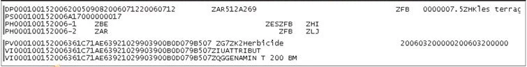
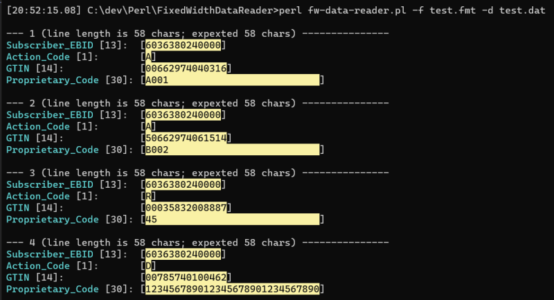

## ABOUT

This tool helps read fixed length formated ASCII text files, often generated in agriculture to send POS sales data, and other information.

### These files can look ugly:

### Example of the program's output from the included test file:

## COMMAND LINE OPTIONS

* `-nc` -- do not color the output. use this option when redirecting output to a file
* `-t` -- process first 3 lines. number of lines this option prints can be configured in the `%config`
* `-s` -- search, or filter option. accepts [Perl-comatible regular expressions](https://perldoc.perl.org/perlre). case-insensitive flag is applied by default, but [regex flags](https://www.regular-expressions.info/modifiers.html) can be be used, inclusing `(?c)` to make it case-sensitive.

## MISC

Additional information:

* Format files expected are generated by [bcp utility](https://docs.microsoft.com/en-us/sql/tools/bcp-utility)
* [Format file description](https://docs.microsoft.com/en-us/sql/relational-databases/import-export/non-xml-format-files-sql-server?view=sql-server-ver16#Structure)

Included files:

* `test.fmt` and `test.dat` are demo data from the PDSubsetUpdate_ASCII.pdf
* Source of the `PDSubsetUpdate_ASCII.pdf`: https://www.agiis.org/Links/PDSubsetUpdate_ASCII.pdf

