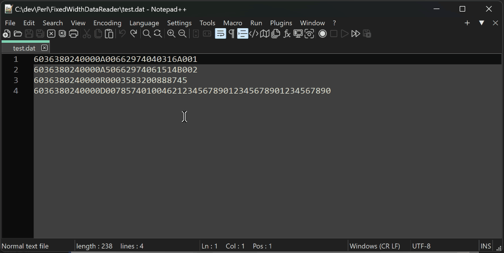

## ABOUT

This tool helps read fixed-length formatted ASCII text files, often generated in agriculture  and used to send POS sales data, inventory, and other information.

### These files can look ugly:


### Example of the program's output from the included test file:


## COMMAND LINE OPTIONS

* `-f` -- [format file](https://learn.microsoft.com/en-us/sql/relational-databases/import-export/non-xml-format-files-sql-server?view=sql-server-ver16#Structure)
* `-d` -- path to a data file, or a data string (can be multi-line string)
* `-nc` -- do not color the output. use this option when redirecting output to a file
* `-t` -- process first 3 lines. number of lines this option prints can be configured in the `%config`
* `-s` -- search, or filter option. accepts [Perl-comatible regular expressions](https://perldoc.perl.org/perlre). case-insensitive flag is applied by default, but [regex flags](https://www.regular-expressions.info/modifiers.html) can be be used, inclusing `(?c)` to make it case-sensitive.

Processing strings from command line arguments with the `-d` option was added to allow usage from within Notepad++ (read more about it below).

## USING WITH NOTEPAD++

It is possible to use this tool with Notepad++ using the [Pork to Sausage](https://github.com/npp-plugins/pork2sausage) plugin to process one or more selected data lines. First, you need to install the plugin and configure it to use this tool. After this, you will be able to simply select one or more lines in the currently open data file and trigger the conversion, the results of which will be displayed directly inside Notepad++ in your open file.

### Demo



### Configure

1. Install Pork to Sausage plugin
2. Configure the plugin by adding following code to the `%AppData%\Notepad++\plugins\config\pork2Sausage.ini` file:

```
[Show POS fields]
progPath=C:\path-to-perl\bin\perl.exe
progCmd=perl C:\path-to-XSPlainTextFileReader\fw-data-reader.pl -nc -f "C:\path-to-format-files\pos.fmt" -d $(SELECTION)
workDir=C:\path-to-XSPlainTextFileReader
```
_NOTE: Make sure to update paths, the format file, and give the action a meaningful name ("Show POS fields" in the example)._


## MISC

Additional information:

* Format files expected are generated by [bcp utility](https://docs.microsoft.com/en-us/sql/tools/bcp-utility)
* [Format file description](https://docs.microsoft.com/en-us/sql/relational-databases/import-export/non-xml-format-files-sql-server?view=sql-server-ver16#Structure)

Included files:

* `test.fmt` and `test.dat` are demo data from the PDSubsetUpdate_ASCII.pdf
* Source of the `PDSubsetUpdate_ASCII.pdf`: https://www.agiis.org/Links/PDSubsetUpdate_ASCII.pdf
